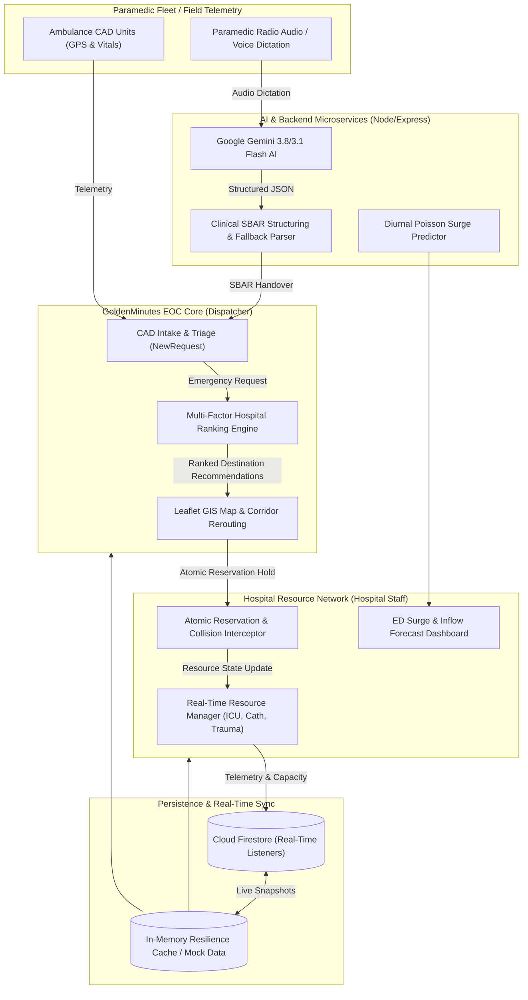

# 🚑 GoldenMinutes: Emergency Operations Center & Hospital Resource Coordination SaaS

> **HackMatrix 5.0 Project**  
> *Every second matters. Every resource counts. Preserving the Golden Hour through real-time coordination.*

---

## 📌 Problem Statement

In critical trauma, acute STEMI myocardial infarctions, and acute ischemic strokes, clinical survival is governed by the **"Golden Hour"**—the critical 60-minute window post-incident where timely, definitive care prevents irreversible mortality or severe neurological deficit.

Today, emergency medical services face severe operational fragmentation:
1. **Asymmetric Resource Visibility:** Dispatchers and paramedics in transit lack real-time visibility into receiving hospitals' actual emergency department (ED) capacity, open catheterization bays, ventilators, and trauma teams.
2. **Blind Drop-offs & Diversion Queues:** Ambulances arrive at overwhelmed emergency rooms only to discover diverted services, forcing secondary rerouting that costs crucial minutes.
3. **Resource Collisions & Double-Booking:** In multi-casualty incidents or dense metropolitan traffic, multiple ambulance units often converge on the single remaining specialized resource (e.g., the last open Level 1 Trauma Bay or ICU Bed).
4. **Stale Telemetry & Phantom Capacity:** Hospital bed status updates reported hours earlier degrade into inaccurate "phantom capacity," leading dispatchers to route high-acuity patients to unavailable facilities.
5. **Lossy Verbal Handover:** Paramedics attempting rapid verbal handover over noisy radio channels frequently omit critical medication dosages, timelines, and vitals trends.

---

## 💡 Solution

**GoldenMinutes** is a high-density, real-time Emergency Operations Center (EOC) and hospital resource coordination SaaS platform designed with a modern **Bloomberg Terminal × Healthcare SaaS** aesthetic:
- **Unified Coordination Grid:** Synchronizes CAD 911/108 dispatch operators, field ambulance paramedic units, and hospital emergency department directors in a single collaborative interface.
- **Intelligent Resource-Matching & Ranking:** Continuously ranks regional medical centers using a multi-factor score factoring specialty match, live transit travel time, data freshness, and historical hospital acceptance rates.
- **Atomic Reservation Hold & Double-Booking Protection:** Secures a single-patient 60-second atomic hold on beds and catheterization labs with automated conflict interception and failover rerouting.
- **Paramedic Voice-to-SBAR Clinical Handover:** Leverages Google Gemini Flash AI to parse paramedic radio dictations into structured **SBAR** (Situation, Background, Assessment, Recommendation) clinical notes with offline fallback.
- **Predictive ML ED Inflow Forecaster:** Analyzes 24-hour diurnal patterns, day-of-week multipliers, weather conditions, and active CAD dispatch spillover to forecast 4-hour patient surges.
- **Dynamic Arterial Rerouting:** Simulates urban bottlenecks and automatically generates green-corridor bypass routes for inbound emergency vehicles.

---

## 🌟 Key Features

| Feature | Description |
| :--- | :--- |
| **Emergency Operations Center (EOC) Dashboard** | Bloomberg-terminal inspired high-density command center with deep navy/charcoal background, white cards, live incident panels, and real-time emergency overview. |
| **Intelligent Routing & Resource Matching** | Dynamic destination recommendation considering resource availability (ICU beds, trauma bays, cath labs), real-time travel time, and data freshness. |
| **Data Freshness & Stale-Data Handling** | Continuously monitors telemetry freshness; flags stale data (>60s) with amber warning indicators and penalizes routing scores to prevent phantom bed assignments. |
| **Hospital Resource Management** | Live bed and equipment availability management (ICU Beds, Emergency Resus, Ventilators, Cath Labs, Trauma Bays) with instant status updates. |
| **Assignment → Reservation → Handoff Workflow** | Complete emergency lifecycle: CAD dispatch assignment, 60-second atomic reservation hold, en-route telemetry tracking, and bedside handoff completion. |
| **Double-Booking Prevention Logic** | Atomic resource locks ensuring beds cannot be claimed simultaneously by multiple ambulances, with automated conflict detection and failover rerouting. |
| **Hospital Accept / Reject Workflow** | Emergency department staff can review incoming emergency requests, evaluate patient vitals, and accept or reject with reason codes. |
| **Role-Based Access Control (RBAC)** | Role-tailored views and access controls for Dispatchers (EOC operations) and Hospital Staff (emergency department & resource control). |
| **Interactive Dispatch Map & Fleet Tracking** | Real-time Leaflet map displaying active ambulance locations, hospital destinations, green corridors, and dynamic roadblock rerouting. |
| **Voice-to-Clinical SBAR Handover AI** | Converts in-transit paramedic voice dictations into structured clinical SBAR (Situation, Background, Assessment, Recommendation) notes powered by Gemini AI with offline fallback. |

---

## 🏗️ System Architecture



---

## 👥 User Roles & Access Control (RBAC)

The application enforces strict Role-Based Access Control (RBAC):

1. **Dispatcher (`dispatcher`):**
   - Central emergency management authority.
   - Access to EOC Command Center, CAD Intake, Multi-Factor Ranked Destinations, Fleet Ambulance tracking, and dynamic roadblock rerouting.
2. **Hospital Staff (`hospital`):**
   - Receiving Emergency Department Directors, Charge Nurses, and Resuscitation Leads.
   - Access to Hospital Overview, Resource Manager, Inbound Emergency Requests, SBAR handovers, Atomic Reservation locks, and ML Surge Predictions.

---

## 💻 Technology Stack

- **Frontend:** React 19, TypeScript, Vite 8, Tailwind CSS 4, Motion (Framer Motion), Lucide React, Leaflet & React Leaflet.
- **Backend & Middleware:** Node.js, Express, TSX, Dotenv.
- **AI & Machine Learning:** Google Gemini 3.8 / 3.1 Flash (`@google/genai`), Poisson Time-Series Regression Engine (`mlSurgePrediction.ts`).
- **Database & Authentication:** Firebase Auth (Google OAuth & Demo Triage Auth), Cloud Firestore with real-time snapshot listeners, Firestore Security Rules (`firestore.rules`).
- **Design System:** Bloomberg Terminal × Modern Healthcare SaaS (Deep Navy `#0a0f1d`, Slate `#1e293b`, Emergency Red, Confirmed Green, Stale Data Amber, Operational Blue).

---

## 🧠 AI / ML Integration

### 1. Paramedic Voice Dictation to Clinical SBAR Handover
- **Model:** Google Gemini 3.8 / 3.1 Flash via `@google/genai`.
- **Endpoint:** `POST /api/summarize-handover`.
- **Task:** Parses noisy paramedic dictations into strict medical JSON adhering to the **SBAR** framework:
  - **Situation:** Immediate life threat and time-to-arrival.
  - **Background:** Patient history, onset timeline, and trauma mechanism.
  - **Assessment:** Hemodynamics, GCS, ECG observations, and vital trends.
  - **Recommendations:** Specific receiving bay, specialist teams to alert, and pre-staged equipment.
- **Resilience:** Includes an autonomous **Clinical Heuristic Fallback Engine** ensuring zero downtime if offline or API quota limits are reached.

### 2. Emergency Inflow & Surge Prediction Engine
- **Model:** Time-series Poisson regression model parameterized by 24-hour diurnal hospital arrival distributions ($N=48,200$ empirical records).
- **Features:**
  - Diurnal arrival probability curve.
  - Day-of-week clinical backlog multipliers.
  - Environmental & road condition shocks ($+38\%$ collision surge).
  - Active CAD dispatch spillover and regional divert cascading effects.
- **Outputs:** 4-hour hourly predicted admissions, 90% confidence intervals, acuity distributions (ESI 1 through 5), and resource demand forecasting (trauma bays, ICU beds, acute beds, and ventilators).

---

## ⚡ Emergency Workflow: Assignment → Reservation → Handoff

1. **CAD Incident Creation & Triage:** Dispatcher logs incoming emergency condition, priority level, location, and required medical resources.
2. **Resource Matching & Destination Ranking:** System algorithmically ranks regional facilities based on resource match, real-time travel time, data freshness, and reliability.
3. **Dispatch & Assignment:** Paramedic unit is assigned to the incident with turn-by-turn routing telemetry.
4. **Atomic 60s Resource Reservation:** Dispatcher or paramedic locks the designated bed/resource, preventing double-booking while in transit.
5. **In-Transit SBAR Handover:** Paramedics transmit in-transit telemetry and voice briefings parsed into structured SBAR notes by Gemini AI.
6. **Hospital ED Confirmation:** Receiving emergency department reviews telemetry, pre-alerts specialist teams, and confirms resource availability.
7. **Arrival & Definitive Handoff:** Ambulance arrives under green-corridor routing, patient is directly admitted to the reserved bed, and handoff is marked complete.

---

## 📊 Resource Matching & Scoring Algorithm

The destination scoring algorithm evaluates hospitals using the formula:

$$\text{Score} = (W_{\text{res}} \times S_{\text{res}}) + (W_{\text{time}} \times S_{\text{time}}) + (W_{\text{fresh}} \times S_{\text{fresh}}) + (W_{\text{rel}} \times S_{\text{rel}}) - P_{\text{stale}}$$

- **Resource Match ($W_{\text{res}} = 0.35$):** Evaluates exact availability of specialized beds, ventilators, open cath labs, or trauma bays.
- **Travel Time ($W_{\text{time}} = 0.35$):** Inverse exponential decay based on real-time transit minutes.
- **Data Freshness ($W_{\text{fresh}} = 0.20$):** High score for updates $< 30$ seconds; penalized if $> 60$ seconds.
- **Historical Reliability ($W_{\text{rel}} = 0.10$):** Hospital acceptance rate and average response latency.
- **Staleness Penalty ($P_{\text{stale}}$):** Severe docking if telemetry timestamp exceeds freshness threshold.

---

## 🔒 Atomic Reservation & Double-Booking Prevention

To eliminate race conditions when multiple ambulances attempt to reserve the same bed:
1. **Single-Occupant Hold:** An atomic hold locks the resource with a synchronized countdown timer.
2. **Immediate Collision Interception:** Concurrent requests for the locked resource trigger an automated conflict alert.
3. **Failover Corridor:** Conflicted units are immediately re-routed to the secondary ranked hospital with matched capabilities.

---

## 🛠️ Installation & Setup

### Prerequisites
- [Node.js](https://nodejs.org/) (v18.0.0 or higher recommended)
- `npm` (v9.0.0 or higher)

### 1. Clone the Repository
```bash
git clone https://github.com/Hiya-lohana/GoldenMinutes.git
cd GoldenMinutes
```

### 2. Install Dependencies
```bash
npm install
```

### 3. Configure Environment Variables
Copy `.env.example` to `.env`:
```bash
cp .env.example .env
```
Populate `.env` with your Gemini API key (optional for local fallback mode):
```env
PORT=3000
GEMINI_API_KEY="your-gemini-api-key"
```

### 4. Run Locally
```bash
npm run dev
```
The full-stack platform will be available at:  
👉 **http://localhost:3000**

---

## 🧪 Verification & Build Commands

```bash
# Type check and linting
npm run lint

# Production bundle build
npm run build

# Preview production build
npm run preview
```

---

## 📁 Project Structure

```
GoldenMinutes/
├── src/
│   ├── components/
│   │   ├── common/
│   │   │   ├── GoogleMapsNavigation.tsx  # Turn-by-turn navigation & route bypass
│   │   │   ├── MapCanvas.tsx             # Interactive Leaflet map canvas
│   │   │   ├── Sidebar.tsx               # Tactical navigation sidebar with role toggle
│   │   │   ├── StatusBadge.tsx           # Status indicators (Code Red, Amber, Green)
│   │   │   ├── ToastContainer.tsx        # Urgent toast alerts & dispatch notifications
│   │   │   ├── TopHeader.tsx             # CAD header, clock, telemetry indicators
│   │   │   └── VoiceHandoverModal.tsx    # Paramedic voice dictation & SBAR briefing
│   │   ├── hospital/
│   │   │   └── SurgeAlertCard.tsx        # ML ED surge prediction visualization
│   │   └── layout/
│   │       └── AppShell.tsx              # Main application chrome and layout wrapper
│   ├── context/
│   │   ├── AuthContext.tsx               # RBAC and Google authentication state
│   │   └── EMSContext.tsx                # Central state, ranking engine, atomic reservation
│   ├── data/
│   │   └── mockData.ts                   # Realistic Mumbai Level 1 trauma and hospital dataset
│   ├── firebase/
│   │   └── config.ts                     # Firebase SDK initialization and error wrappers
│   ├── pages/
│   │   ├── auth/
│   │   │   └── Login.tsx                 # Tactical authentication portal
│   │   ├── dispatcher/
│   │   │   ├── CommandCenter.tsx         # EOC main command center
│   │   │   ├── NewRequest.tsx            # CAD emergency intake workflow
│   │   │   ├── ActiveRequests.tsx        # Active live emergency registry
│   │   │   ├── EmergencyDetails.tsx      # Deep dive into individual emergency incident
│   │   │   ├── RankedHospitals.tsx       # Multi-factor ranked destination recommendations
│   │   │   ├── HospitalCapacity.tsx      # Regional hospital capacity matrix
│   │   │   ├── HospitalDetails.tsx       # Hospital specialty & resource inventory
│   │   │   ├── FleetAmbulances.tsx       # Fleet tracking and telemetry overview
│   │   │   ├── AmbulanceDetails.tsx      # Ambulance crew, status, and telemetry view
│   │   │   ├── DispatchMap.tsx           # Full-screen GIS dispatch operations map
│   │   │   ├── DispatcherActivity.tsx    # Live chronological audit log
│   │   │   └── DispatcherHistory.tsx     # Historical case logs and outcomes
│   │   └── hospital/
│   │       ├── HospitalOverview.tsx      # Hospital ED intake dashboard
│   │       ├── IncomingRequests.tsx      # Inbound patient transfers & reservations
│   │       ├── RequestDetails.tsx        # Detailed clinical handover & resus bay prep
│   │       ├── DoubleBookingDemo.tsx     # Interactive collision interception simulation
│   │       ├── ResourceManager.tsx       # Bed, vent, cath bay availability controller
│   │       ├── Reservations.tsx          # Active 60s reservation holds tracker
│   │       ├── Predictions.tsx           # ML 4-hour ED surge prediction console
│   │       ├── HospitalActivity.tsx      # Hospital department audit stream
│   │       └── HospitalHistory.tsx       # Emergency department disposition history
│   ├── types/
│   │   └── index.ts                      # Domain models, enums, and data contracts
│   ├── utils/
│   │   └── mlSurgePrediction.ts          # Poisson regression & surge forecasting logic
│   ├── App.tsx                           # Master client router and layout manager
│   ├── index.css                         # Tailwind CSS styling and Leaflet overrides
│   └── main.tsx                          # React 19 entry point
├── server.ts                             # Express full-stack API server with Gemini AI
├── firestore.rules                       # Firestore security rules and schema guards
├── firebase-blueprint.json               # Firestore entity schema specifications
├── package.json                          # Dependencies and build scripts
├── tsconfig.json                         # TypeScript configuration
├── vite.config.ts                        # Vite configuration
└── .env.example                          # Environment variable template
```

---

## 👥 HackMatrix 5.0 Team Contributions

| Member | GitHub Handle | Primary Responsibilities & Contributions |
| :--- | :--- | :--- |
| **Hiya Lohana** *(Team Lead)* | [@Hiya-lohana](https://github.com/Hiya-lohana) | **Project Lead & Dispatch / AI Specialist:** Overall project leadership and coordination, CAD New Request intake workflow, multi-factor destination ranking algorithm, 4-hour ML surge prediction engine (Poisson regression model), and roadblock bypass routing. |
| **Ashmith Aahirwar** | [@Ashcraft30](https://github.com/Ashcraft30) | **Frontend & EOC Command Center Lead:** Built the tactical high-density EOC Command Center, responsive app shell, tactical sidebar, header telemetry, live incident cards, StatusBadge design system, and Leaflet GIS MapCanvas integration. |
| **Aditya Lulla** | [@Aditya71310](https://github.com/Aditya71310) | **Hospital & Resource Management Lead:** Built the Hospital ED Overview, real-time Resource Manager (ICU/Cath/Trauma beds), 60-second atomic reservation hold system, accept/reject workflows, double-booking collision demo, and staleness handling. |
| **Kashish Bagde** | [@kashishbagde14](https://github.com/kashishbagde14) | **Backend, Security, Data Layer & Documentation:** Built the Node/Express server, Gemini 3.8/3.1 Flash AI SBAR handover API with heuristic fallback, RBAC authentication (AuthContext), Firestore security rules (`firestore.rules`), seed datasets, and comprehensive technical documentation. |

---

## 📜 License & Compliance

Developed for **HackMatrix 5.0**. Built with clinical accuracy principles, emergency operations data integrity standards, and role-based patient security safeguards.
